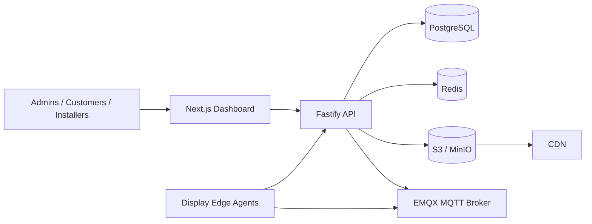

# HoloLED Cloud Architecture

## Product Requirements Document
HoloLED Cloud is a multi-tenant SaaS platform for advertising operators to onboard, monitor, schedule, update, and analyze commercial hologram and 3D LED display fleets. The first launch market is Karachi, Pakistan. The platform must scale to thousands of devices and remain hardware-agnostic through a standard device protocol and future vendor adapters.

## Functional Requirements
- Company and user management.
- RBAC for platform admin, company admin, operations manager, installer, customer viewer, finance.
- Device creation, pairing, grouping, remote command, heartbeat, telemetry, online/offline status.
- Media upload via presigned object storage URLs.
- Media readiness lifecycle.
- Playlists and schedule targeting by device or group.
- Device sync manifest generation.
- OTA release and assignment orchestration.
- Audit logs for sensitive actions.
- Billing-ready subscription model.

## Non-functional Requirements
- API p95 under 250ms for normal CRUD at steady load.
- Heartbeat ingest scalable horizontally.
- Tenant isolation enforced at API and database query layers.
- JWT access tokens with short TTL and refresh token rotation storage.
- Object storage for media and OTA artifacts.
- MQTT for device command/telemetry with QoS 1.
- Postgres as source of truth.
- Redis reserved for queueing, cache, rate-limit, websocket fan-out.

## Technology Stack
- Backend: TypeScript Fastify because it is fast, strongly typed, production-proven, and lighter than larger frameworks.
- Frontend: Next.js because it supports production React dashboards, SSR where needed, and deployment flexibility.
- Database: PostgreSQL because relational integrity matters for scheduling, billing, tenants, audit, and devices.
- ORM: Prisma because it provides type-safe schema and migrations.
- Storage: S3-compatible object storage because it supports MinIO locally and AWS S3 / compatible providers in production.
- Queue/cache: Redis because it supports queues, cache, rate limiting, and pub/sub.
- MQTT: EMQX because it is a production MQTT broker with clustering and dashboard support.
- Containerization: Docker.
- Orchestration-ready: Kubernetes-ready stateless API and web containers.

## Architecture Diagram

## Device Communication Protocol
- REST pairing endpoint exchanges serial number and one-time pairing code for device identity.
- MQTT topics:
  - commands: devices/{deviceId}/commands
  - telemetry: devices/{deviceId}/telemetry
  - acknowledgements: devices/{deviceId}/acks
- REST heartbeat fallback: POST /devices/{deviceId}/heartbeat.
- Sync manifest: GET /devices/{deviceId}/sync-manifest.

## Offline Mode
The device agent must cache the active manifest and media locally. If cloud is unavailable, playback continues from the last valid manifest. The next successful sync compares checksums and downloads missing assets.

## Conflict Resolution
Schedules are resolved by active window, target specificity, and priority. Higher priority wins. Ties are resolved by newest updatedAt and deterministic schedule id ordering.

## OTA Design
Cloud stores OTA artifacts and metadata. Devices receive OTA_UPDATE commands with artifact key and checksum. Device adapter validates checksum, compatibility, battery/power/network safety, installs according to vendor-specific method, and reports completion or failure.

## Security Model
- TLS required in production for API, dashboard, MQTT over TLS, and object storage.
- Short-lived JWT access token.
- Refresh token stored hashed.
- RBAC enforced per route.
- Tenant isolation via companyId checks.
- Audit log for privileged actions.
- Rate limiting enabled.
- Helmet security headers enabled.
- Presigned URLs expire quickly.

## Threat Model
- Stolen user credentials: mitigated by password hashing, short token TTL, audit logs, future MFA.
- Rogue device pairing: mitigated by one-time pairing code hash and serial binding.
- Cross-tenant data access: mitigated by companyId authorization.
- Media abuse: mitigate by MIME allowlist, size limits, processing sandbox in production.
- Command spoofing: MQTT auth and per-device topics required in production.

## Deployment
Local deployment uses Docker Compose. Production should run API and web as stateless containers behind an ingress/load balancer, Postgres managed HA, Redis managed HA, S3-compatible storage, CDN, and EMQX cluster.

## Backups and Disaster Recovery
- PostgreSQL point-in-time recovery.
- S3 bucket versioning and lifecycle policies.
- Daily encrypted backups retained 35 days.
- Quarterly restore drills.
- RPO target 15 minutes, RTO target 4 hours for launch scale.

## Testing Strategy
- Unit tests for scheduling, RBAC, validation.
- Integration tests with Postgres and MinIO.
- Contract tests for device protocol.
- Load tests for heartbeat and sync endpoints.
- Security tests for tenant isolation and auth bypass.

## Future Roadmap
- MFA and SSO.
- Full billing integration.
- Media transcoding workers with FFmpeg.
- WebSocket live dashboard.
- Geofenced campaign analytics.
- Hardware vendor adapter SDK.
- Predictive maintenance.
